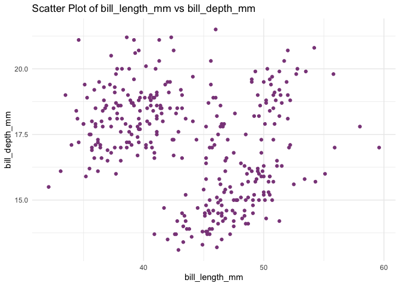
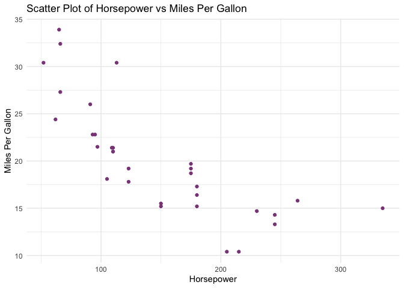
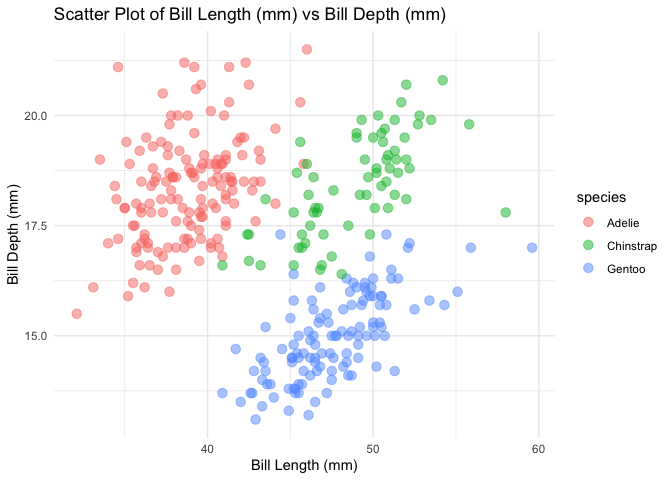

Make a Scatter Plot
================

<!-- README.md is generated from README.Rmd. Please edit that file -->

# Package Description

This package provides a function that creates a scatter plot from two
specified numeric columns in a data frame. Users can customize the plot
by adjusting axis labels, colors, and additional `geom_point()`
parameters. This is particularly useful for quick and professional
visualizations of the relationship between two numerical variables.

## Installation

You can install the package from Github using the following command:

``` r
devtools::install_github("AlisonLuo/plotter", ref = "0.1.0")
```

## Example

Here are some examples of how to use the `scatter()` function in this
package:

``` r
library(plotter)
library(palmerpenguins)

# Example using the penguins dataset
scatter(penguins, bill_length_mm, bill_depth_mm)
```



``` r

# Example using a different dataset (mtcars) and incorporating custom axis labels
scatter(mtcars, hp, mpg, 
        x_label = "Horsepower", 
        y_label = "Miles Per Gallon")
```



``` r

# Example using the penguins dataset, colouring points by species and customizing point size
scatter(penguins, bill_length_mm, bill_depth_mm, 
        x_label = "Bill Length (mm)", 
        y_label = "Bill Depth (mm)", 
        colour = "species",      # Colour points by species
        size = 3,               # Customize point size
        alpha = 0.5)            # Adjust transparency of points
```



## License

This package is licensed under the MIT License.
