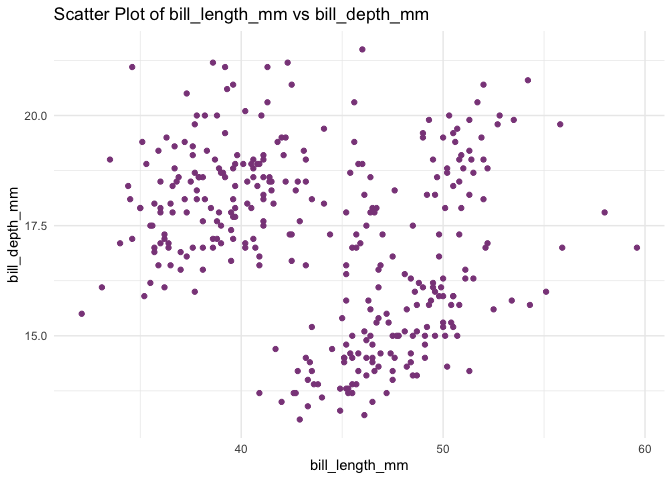
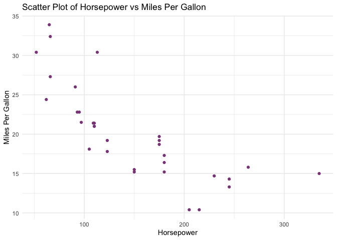
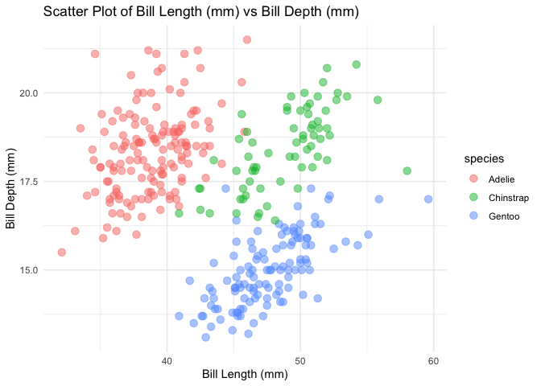

Create a Scatter Plot from a Dataframe
================

<!-- README.md is generated from README.Rmd. Please edit that file -->

## Package Description

This package provides a function that creates a scatter plot from two
specified numeric columns in a dataframe. Users can customize the plot
by adjusting axis labels, colors, and additional `geom_point()`
parameters. This is particularly useful for quick and professional
visualizations of the relationship between two numerical variables.

## Installation

You can install version 0.1.3 of the package from Github using the
following command in your R Studio Console. Make sure that the
`devtools` package is installed prior to this.

``` r
devtools::install_github("AlisonLuo/plotter", ref = "0.1.3")
```

## Example

Below are some examples of how to use the `scatter()` function in the
`plotter` package. Keep in mind that two of the three examples use the
`penguins` dataframe, so make sure to load the palmerpenguins package
using `library(palmerpenguins)`.

``` r
# load necessary packages
library(plotter)
library(palmerpenguins)
```

Example 1 using the penguins dataset

``` r
scatter(penguins, bill_length_mm, bill_depth_mm)
```



Example 2 using a different dataset (mtcars) and incorporating custom
axis labels

``` r
scatter(mtcars, hp, mpg, 
        x_label = "Horsepower", 
        y_label = "Miles Per Gallon")
```



Example 3 using the penguins dataset, colouring points by species and
customizing point size

``` r
scatter(penguins, bill_length_mm, bill_depth_mm, 
        x_label = "Bill Length (mm)", 
        y_label = "Bill Depth (mm)", 
        colour = "species",     # Colour points by species
        size = 3,               # Customize point size
        alpha = 0.5)            # Adjust transparency of points
```



## License

This package is licensed under the MIT License.
